# Ansible Configuration Management with Jenkins and GitHub

> **DevOps Portfolio Project --- Infrastructure as Code, Configuration
> Management & CI/CD**

## Table of Contents

-   [Project Overview](#project-overview)
-   [Project Objectives](#project-objectives)
-   [Architecture](#architecture)
-   [Technology Stack](#technology-stack)
-   [Repository Structure](#repository-structure)
-   [Implementation](#implementation)
    -   [1. Ansible Control Node](#1-ansible-control-node)
    -   [2. SSH Key-Based
        Authentication](#2-ssh-key-based-authentication)
    -   [3. Ansible Inventory](#3-ansible-inventory)
    -   [4. Ansible Playbooks](#4-ansible-playbooks)
-   [Testing and Validation](#testing-and-validation)
-   [CI/CD Pipeline](#cicd-pipeline)
-   [GitHub Webhook Integration](#github-webhook-integration)
-   [Jenkins Automation](#jenkins-automation)
-   [Security](#security)
-   [Project Workflow](#project-workflow)
-   [Challenges and Troubleshooting](#challenges-and-troubleshooting)
-   [Lessons Learned](#lessons-learned)
-   [Future Improvements](#future-improvements)
-   [Conclusion](#conclusion)

------------------------------------------------------------------------

## Project Overview

This project demonstrates the implementation of an **Ansible-based
configuration management solution integrated with GitHub and Jenkins**.

The primary goal was to automate common Linux server administration
tasks instead of performing them manually on each remote server.

An Ubuntu server was configured as the **Ansible control node**. SSH
key-based authentication was established between the control node and
the managed servers, allowing Ansible to remotely execute configuration
tasks.

The Ansible project was organized into separate `inventory` and
`playbooks` directories. A development inventory file was created to
define the remote hosts, while multiple Ansible playbooks were developed
to automate:

-   Installation of Wireshark.
-   Creation of a directory and file on a remote server.
-   Configuration of the server timezone to `Africa/Nairobi`.

The project was then integrated with a **GitHub repository and
Jenkins**. A GitHub webhook was configured so that a repository change
can trigger the Jenkins job automatically.

The resulting workflow demonstrates a practical **Infrastructure as Code
(IaC) and CI/CD approach to configuration management**.

------------------------------------------------------------------------

## Project Objectives

The project was designed to achieve the following objectives:

1.  Configure an Ansible server to act as a control node.
2.  Establish SSH connectivity between the control node and remote Linux
    servers.
3.  Configure passwordless/key-based SSH authentication for automation.
4.  Create an Ansible inventory for development servers.
5.  Develop reusable Ansible playbooks for common server administration
    tasks.
6.  Automate software installation across remote servers.
7.  Automate filesystem configuration.
8.  Automate timezone configuration.
9.  Store infrastructure automation code in GitHub.
10. Integrate GitHub with Jenkins using a webhook.
11. Automatically trigger Jenkins when changes are pushed to the
    repository.
12. Demonstrate an end-to-end automated configuration management
    workflow.

------------------------------------------------------------------------

# Architecture

## High-Level Architecture

The architecture consists of a developer workstation, GitHub,
Jenkins/Ansible control node, and multiple managed servers.

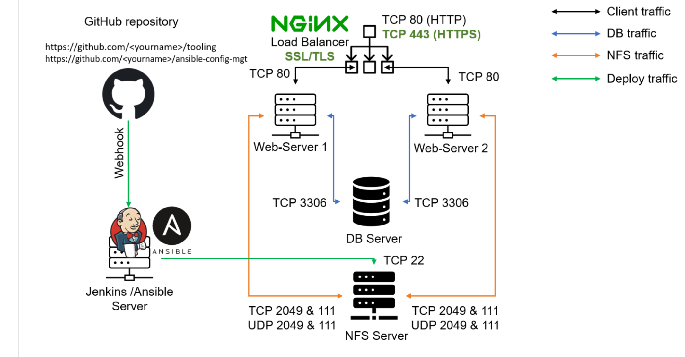

### Architecture Components

  -----------------------------------------------------------------------
  Component                           Role
  ----------------------------------- -----------------------------------
  **Developer PC**                        Used to create and modify Ansible
                                      automation code

  **GitHub**                              Version control and central
                                      repository for the automation code

  **GitHub Webhook**                      Sends an event to Jenkins when
                                      repository changes occur

  **Jenkins**                             Automates the CI/CD execution
                                      workflow

  **Ansible Control Node**              Executes playbooks against managed
                                      servers

  **Ansible Inventory**                 Defines and groups the managed
                                      hosts

  **SSH**                                 Secure communication between the
                                      control node and managed servers

  **RHEL 8 Servers**                      Remote servers managed by Ansible

  **Ubuntu Server**                      Remote development
                                      server/load-balancer environment
  -----------------------------------------------------------------------

# Repository Structure

The Ansible project is organized to separate inventory configuration
from automation playbooks.

``` text
ansible-configuration-mgmt/
│
├── inventory/
│   └── dev.ini
│
├── playbooks/
│   ├── install-wireshark.yml
│   ├── create-directory-file.yml
│   └── change-timezone.yml
│
├── images/
```
------------------------------------------------------------------------

# Implementation

## 1. Ansible Control Node

Ansible was installed on a dedicated server that acts as the **control
node**.

The control node is responsible for:

-   Maintaining the inventory.
-   Storing the playbooks.
-   Connecting to remote servers through SSH.
-   Executing configuration tasks.
-   Returning execution results.
-   Serving as the automation environment used by Jenkins.

### Verify Ansible Installation
SSH to the ansible server and execeute the commands below to install ansible.
``` bash
sudo apt update
ansible --version
```
### Screenshot

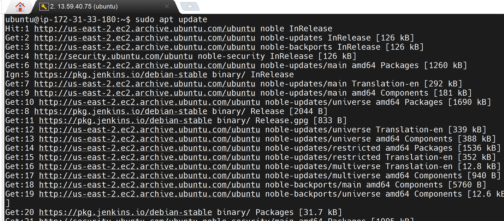
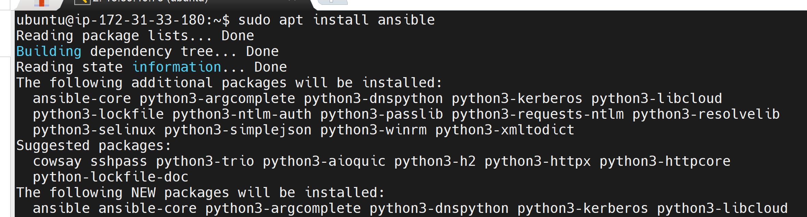

------------------------------------------------------------------------

## 2. SSH Key-Based Authentication

Ansible uses SSH to communicate with the managed servers.

SSH key-based authentication was configured between the Ansible control
node and the remote hosts.

The SSH private key used for the Ansible connection was stored securely
on the control node.

> **Security:** Never commit the private SSH key to GitHub.

### SSH Key Location

The configured SSH key was:

``` text
/home/ubuntu/.ssh/ansible_key
```
### Test SSH Connectivity
``` bash
ssh -i /home/ubuntu/.ssh/ansible_key ubuntu@<REMOTE_SERVER_IP>
```
Successful SSH access confirms that the control node can communicate
with the managed host.

### Screenshot
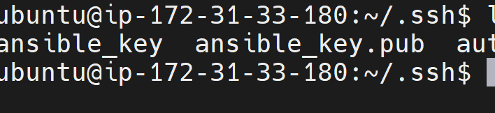
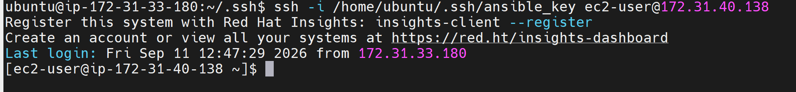

------------------------------------------------------------------------

# 3. Ansible Inventory

Ansible inventory defines the hosts that are managed by Ansible.

A dedicated `inventory` directory was created in the project:

``` text
inventory/
└── dev.ini
```

The `dev.ini` file contains the IP addresses/host definitions of the
development servers.

### Example Inventory

``` ini
[webservers]
web-server-1 ansible_host=<WEB_SERVER_1_IP> ansible_ssh_private_key_file=/home/ubuntu/.ssh/ansible_key

web-server-2 ansible_host=<WEB_SERVER_2_IP> ansible_ssh_private_key_file=/home/ubuntu/.ssh/ansible_key


[database]
db-server ansible_host=<DATABASE_SERVER_IP> ansible_ssh_private_key_file=/home/ubuntu/.ssh/ansible_key


[nfs]
nfs-server ansible_host=<NFS_SERVER_IP> ansible_ssh_private_key_file=/home/ubuntu/.ssh/ansible_key


[loadbalancer]
load-balancer ansible_host=<LOAD_BALANCER_IP> ansible_ssh_private_key_file=/home/ubuntu/.ssh/ansible_key

```

### Screenshot
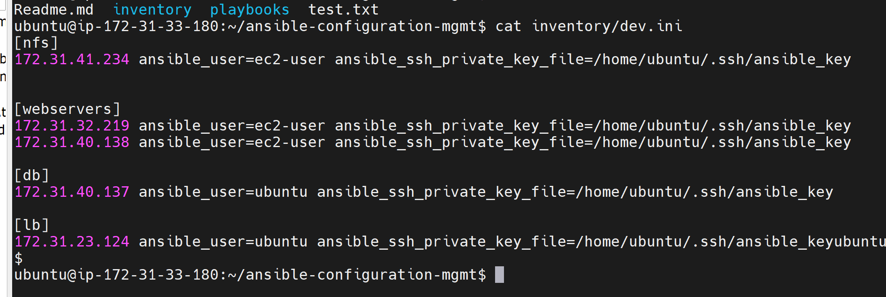

------------------------------------------------------------------------

# 4. Ansible Playbooks

Three playbooks were developed as part of the project.

  -----------------------------------------------------------------------
  Playbook                            Purpose
  ----------------------------------- -----------------------------------
  `common.yml`             Installs Wireshark on managed
                                      servers

  `createfile.yml`         Creates a directory and file on a
                                      remote server
  -----------------------------------------------------------------------
### Screenshot
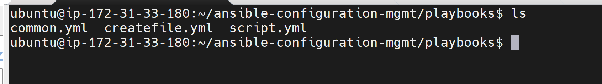

These playbooks demonstrate software management, filesystem management,
and operating-system configuration.

------------------------------------------------------------------------

## Playbook 1: Install Wireshark

### Objective

The first playbook automates the installation of Wireshark on the remote
servers.

This eliminates the need to manually log into each server and install
the package individually.

### Playbook
```
---
- name: Update web, nfs
  hosts: webservers, nfs
  become: yes

  tasks:
    - name: Ensure Wireshark is installed at the latest version
      yum:
        name: wireshark
        state: latest

- name: Update load balancer servers
  hosts: lb
  become: yes

  tasks:
    - name: Update apt repository
      apt:
        update_cache: yes

    - name: Ensure Wireshark is installed at the latest version
      apt:
        name: wireshark
        state: latest
```
### Execute

``` bash
ansible-playbook -i inventory/dev.ini  playbooks/common.yml
```

### Validation

Verify that Wireshark is was not installed and  installed on a managed server:

``` bash
wireshark --version
```
### Screenshot
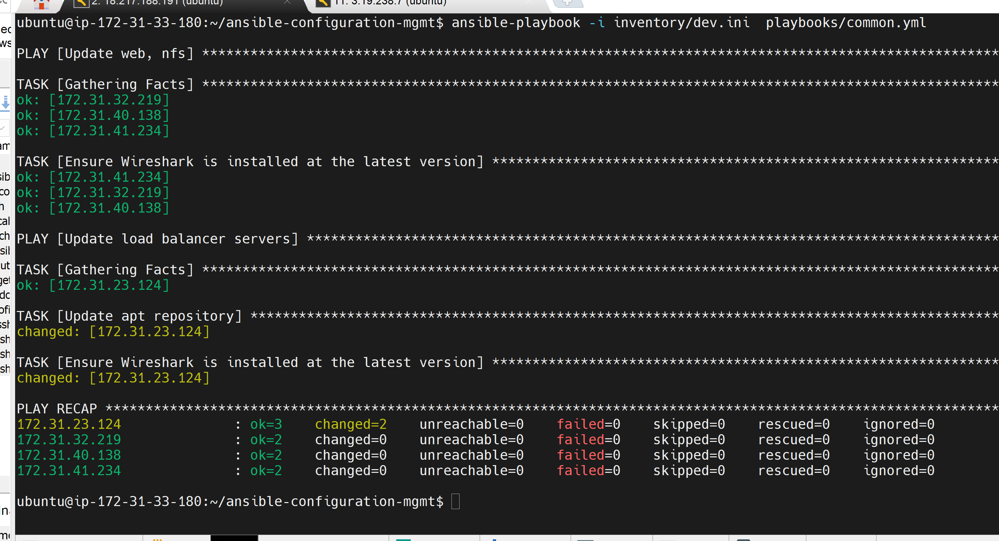
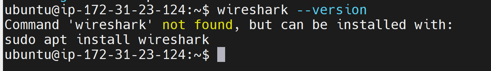
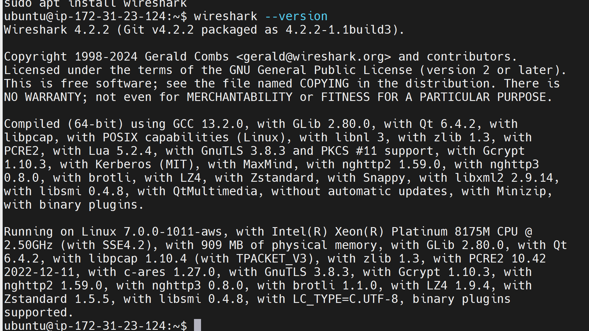

------------------------------------------------------------------------

# Playbook 2: Create Directory and File

## Objective

The second playbook automates the creation of a directory and a file on
a remote server.

This demonstrates Ansible's ability to manage filesystem resources
remotely.

### Playbook
``` yaml
---
- name: Create a new directory and file inside it
  hosts: db
  become: yes
  tasks:
    - name: Create a new directory
      ansible.builtin.file:
        path: /tmp/TEST
        state: directory
        mode: '0755'
    - name: Create file
      ansible.builtin.file:
        path: /tmp/TEST/sample.txt
        state: touch
        mode: '0644'
    - name: Add configuration in the file
      ansible.builtin.copy:
        dest: /tmp/TEST/sample.txt
        content: |
          Application: MyApp
          Environment: Dev
          Managed by: Ansible
        mode: '0644'

```
### Execute
``` bash
ansible-playbook -i inventory/dev.ini  playbooks/createfile.yml
```

### Screenshot
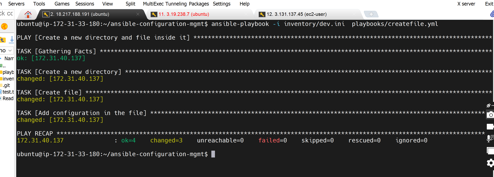
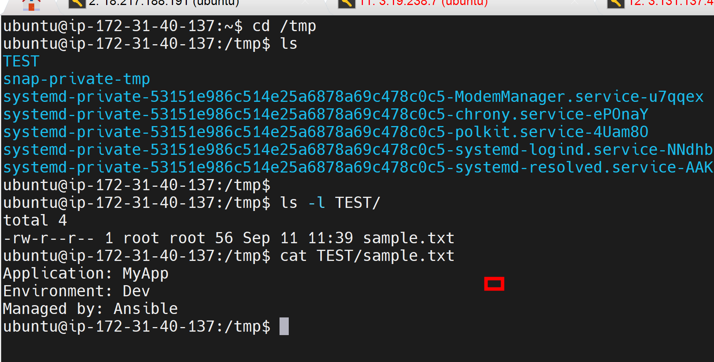


------------------------------------------------------------------------

# Playbook 3: Change Server Timezone

## Objective

The third playbook automates timezone configuration across the remote
servers.

The project configured the timezone as:

``` text
Africa/Nairobi
```

### Playbook

The `community.general.timezone` module was used for timezone
configuration.
``` yaml
- name: Configure a new timezone
  hosts: db
  become: yes
  tasks:
     - name: Set timezone to GMT
       community.general.timezone:
         name: Africa/Nairobi
```

### Execute

``` bash
ansible-playbook -i inventory/dev.ini  playbooks/createfile.yml
```
### Screenshot
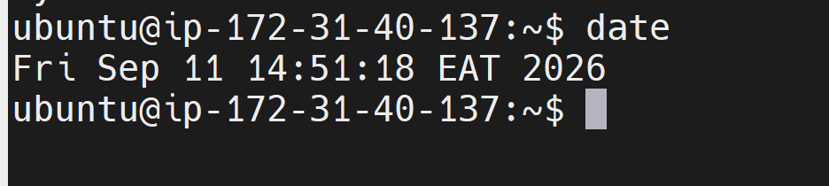
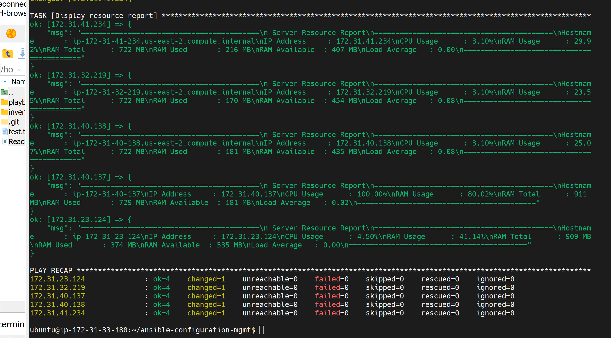

------------------------------------------------------------------------
# Playbook 4: Monitor cpu mempry on remote hosts
------------------------------------------------------------------------
```yaml
---
- name: Check CPU and RAM
  hosts: all
  become: yes

  tasks:
    - name: Copy monitoring script
      ansible.builtin.copy:
        src: /tmp/cpu.sh
        dest: /tmp/cpu.sh
        mode: '0755'

    - name: Run resource monitoring script
      ansible.builtin.command:
        cmd: /bin/bash /tmp/cpu.sh
      register: cpu_report

    - name: Display resource report
      ansible.builtin.debug:
        msg: "{{ cpu_report.stdout }}"

```


# Testing and Validation

Testing was performed at different stages to verify that the automation
environment was working correctly.

## 1. SSH Connectivity Test

The first validation step was to confirm that the Ansible control node
could connect to the remote servers.

``` bash
ssh -i /home/ubuntu/.ssh/ansible_key ubuntu@<REMOTE_SERVER_IP>
```

**Expected result:** Successful SSH authentication.

------------------------------------------------------------------------

## 2. Inventory Validation

The configured hosts can be displayed using:

``` bash
ansible all \
  -i inventory/dev.ini \
  --list-hosts
```
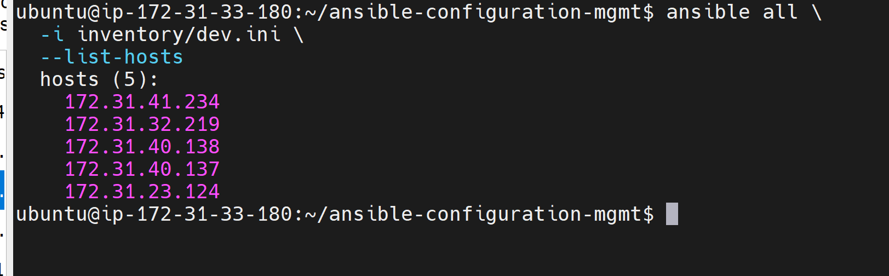

This confirms that Ansible is reading the expected hosts from the
inventory.

------------------------------------------------------------------------

## 3. Playbook Syntax Validation

Before executing a playbook, syntax can be checked with:

``` bash
ansible-playbook -i inventory/dev.ini --syntax-check playbooks/script.yml
```
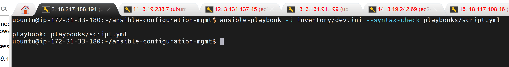

The same validation can be performed against the other playbooks.

------------------------------------------------------------------------

## 4. Ansible Check Mode

Ansible check mode can be used to preview changes before applying them:

``` bash
ansible-playbook \
  -i inventory/dev.ini \
  playbooks/script.yml \
  --check
```
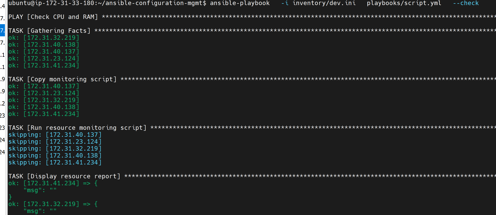

This provides an additional safety mechanism when testing configuration
changes.

------------------------------------------------------------------------

## 5. Idempotency Testing

Ansible playbooks are designed to be **idempotent**, meaning repeated
execution should not continuously make the same changes.

Running the same playbook again should report fewer changes once the
desired state already exists.

This is an important characteristic of configuration management because
it allows automation to be safely repeated.

------------------------------------------------------------------------

# CI/CD Pipeline

The project integrates GitHub, Jenkins and Ansible to create an
automated configuration management workflow.

The pipeline is:

``` text
Developer
    |
    | git push
    v
GitHub Repository
    |
    | GitHub Webhook
    v
Jenkins
    |
    | Checkout latest code
    v
Ansible Control Node
    |
    | Execute Playbook
    v
Remote Servers
    |
    v
Configuration Applied
```

This approach means that infrastructure automation code is managed using
the same version-control and automation principles commonly used in
application CI/CD.

------------------------------------------------------------------------

# GitHub Webhook Integration

A GitHub webhook was configured for the project repository.

The webhook allows GitHub to notify Jenkins whenever a repository event
occurs, such as a push.

### Workflow

``` text
Git Push
   |
   v
GitHub detects repository change
   |
   v
GitHub sends webhook
   |
   v
Jenkins receives webhook
   |
   v
Jenkins starts configured job
```

### Screenshot
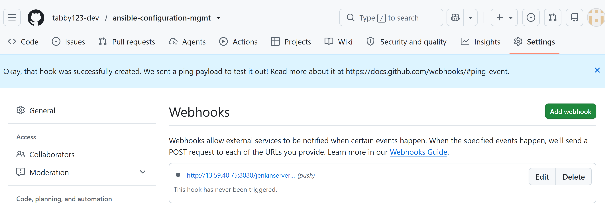

------------------------------------------------------------------------

# Jenkins Automation

Jenkins was configured to execute the Ansible automation workflow.

The Jenkins job performs the following high-level operations:

1.  Receives the GitHub webhook.
2.  Starts the Jenkins job.
3.  Checks out the latest repository version.
4.  Loads the latest inventory and playbooks.
5.  Executes the required Ansible playbook.
6.  Reports the execution result.

### Jenkins Job

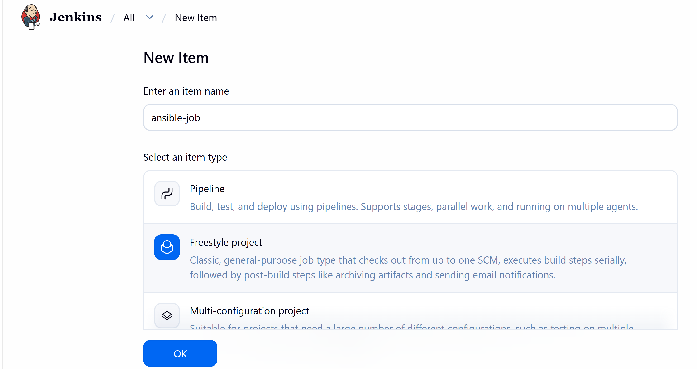

### Successful Build
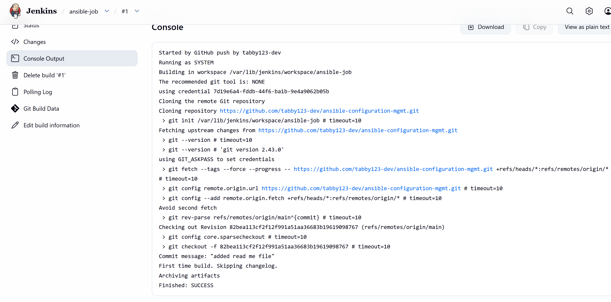
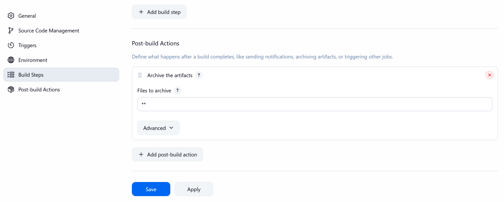
------------------------------------------------------------------------

# Jenkins Pipeline Design

The intended CI/CD flow can be represented as:

``` text
+----------------------+
| Developer             |
| Modify Ansible Code   |
+----------+-----------+
           |
           | git push
           v
+----------------------+
| GitHub Repository     |
+----------+-----------+
           |
           | Webhook
           v
+----------------------+
| Jenkins               |
|                       |
| 1. Checkout           |
| 2. Validate           |
| 3. Execute Ansible    |
+----------+-----------+
           |
           v
+----------------------+
| Ansible Control Node  |
+----------+-----------+
           |
           | SSH
           v
+----------------------+
| Managed Servers       |
|                       |
| Web / DB / NFS / LB   |
+----------------------+
```

------------------------------------------------------------------------

# Project Workflow

The complete project workflow is:

### Step 1 --- Development

The developer creates or modifies an Ansible playbook locally.

``` text
VS Code
   |
   v
Ansible Playbook
```

### Step 2 --- Version Control

The changes are committed and pushed to GitHub.

``` bash
git add .
git commit -m "Update Ansible configuration"
git push origin main
```

### Step 3 --- GitHub Webhook

GitHub sends a webhook to Jenkins.

``` text
GitHub
   |
   | Webhook
   v
Jenkins
```

### Step 4 --- Jenkins Execution

Jenkins checks out the latest version of the repository.

``` text
Jenkins
   |
   v
Latest Ansible Code
```

### Step 5 --- Ansible Execution

Jenkins executes the Ansible playbook.

``` text
ansible-playbook -i inventory/dev.ini playbooks/<playbook>.yml
```

### Step 6 --- Remote Configuration

Ansible connects to the managed nodes over SSH and applies the required
configuration.

``` text
Ansible Control Node
          |
          | SSH
          v
    Remote Servers
```

### Step 7 --- Validation

The resulting server state is validated using Ansible output and
operating-system commands such as:

------------------------------------------------------------------------

# Challenges and Troubleshooting

## SSH Authentication

One of the key requirements of the project was establishing reliable SSH
connectivity between the control node and managed servers.

The Ansible control node was configured with an SSH key specifically for
automated connections:

``` text
/home/ubuntu/.ssh/ansible_key
```

Ansible successfully connected to the configured reachable hosts.

During testing, one remote host remained unreachable because of an SSH
public-key authentication issue. This demonstrated the importance of
validating SSH connectivity independently before troubleshooting Ansible
itself.

### Troubleshooting Approach

The following commands are useful when diagnosing SSH connectivity:

``` bash
ssh -v -i /home/ubuntu/.ssh/ansible_key ubuntu@<REMOTE_SERVER_IP>
```

Verify the public key exists on the remote server:

``` bash
cat ~/.ssh/authorized_keys
```

Check SSH permissions:

``` bash
chmod 700 ~/.ssh
chmod 600 ~/.ssh/authorized_keys
```

Then retest:

``` bash
ssh -i /home/ubuntu/.ssh/ansible_key ubuntu@<REMOTE_SERVER_IP>
```

------------------------------------------------------------------------

# Lessons Learned

This project provided practical experience with several DevOps concepts.

## 1. Infrastructure as Code

Infrastructure configuration can be represented as code instead of
relying on manual server administration.

This makes configuration:

-   Repeatable
-   Version controlled
-   Auditable
-   Easier to maintain

## 2. Configuration Management

Ansible provides a consistent mechanism for applying configurations to
multiple servers.

For example, instead of manually changing the timezone on every server,
one playbook can define the desired state.

## 3. SSH Is Fundamental to Ansible

Reliable SSH connectivity is a prerequisite for traditional Ansible
management of Linux hosts.

Testing SSH independently makes troubleshooting much easier.

## 4. Version Control for Infrastructure

Storing Ansible playbooks in GitHub provides a history of infrastructure
changes.

This makes it possible to determine:

-   What changed?
-   Who changed it?
-   When was it changed?
-   Why was it changed?

## 5. CI/CD Can Be Applied to Infrastructure

Jenkins is not limited to application deployment.

The same CI/CD principles can be applied to infrastructure and
configuration management.

A code change can trigger:

``` text
GitHub
   ↓
Webhook
   ↓
Jenkins
   ↓
Ansible
   ↓
Infrastructure
```


# Project Skills Demonstrated

This project demonstrates practical experience in:

-   Linux administration
-   Ansible
-   Configuration management
-   Infrastructure as Code
-   SSH
-   Git
-   GitHub
-   Jenkins
-   CI/CD
-   YAML
-   Remote server administration
-   Automated software installation
-   Filesystem automation
-   System configuration
-   Webhook-based automation
-   Troubleshooting
-   Infrastructure security

------------------------------------------------------------------------

# Conclusion

This project demonstrates an end-to-end approach to **automated Linux
server configuration management using Ansible**, with GitHub and Jenkins
providing version control and CI/CD automation.

The implementation moves server administration away from repetitive
manual configuration toward a repeatable, version-controlled and
automated workflow.

The project establishes a foundation that can be expanded into a more
advanced infrastructure automation platform by introducing Ansible
roles, environment separation, secrets management, automated testing,
monitoring and a fully declarative Jenkins pipeline.

------------------------------------------------------------------------
